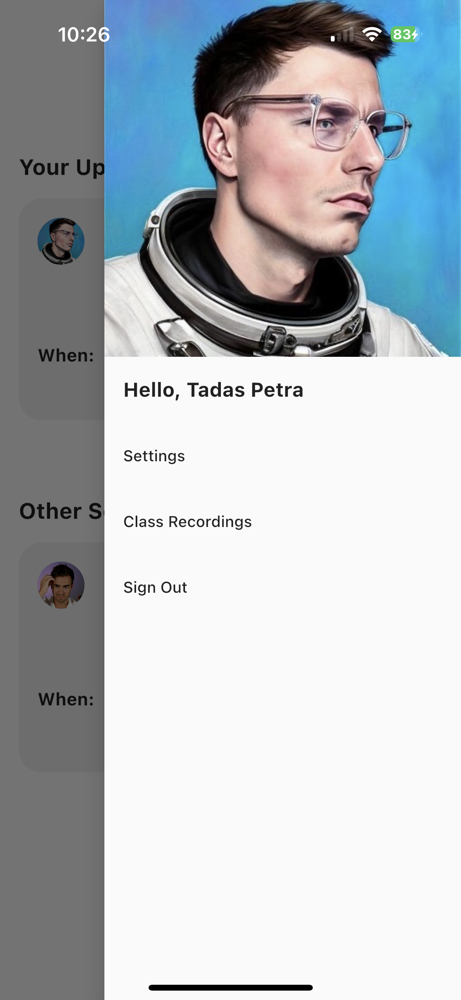
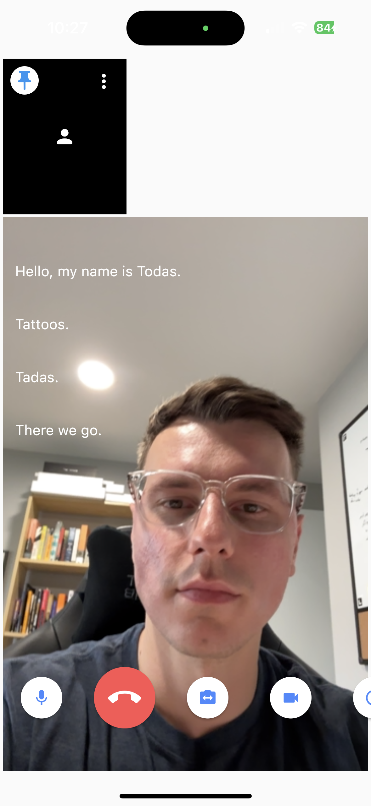
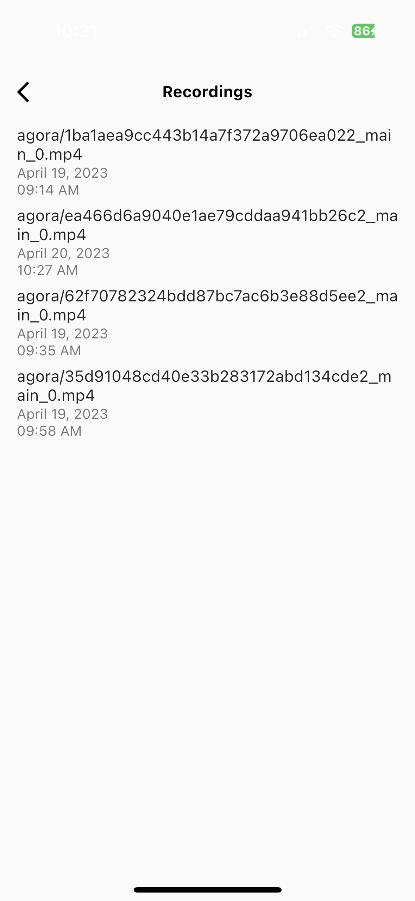

# Build Your own Tutoring Application with Agora

This guide walks you through building your own tutoring application. This application will allow you to create lessons as a teacher, and pay for and attend lessons as a student. These video lessons will be hosted on the platform. This will be a complete application including authentication, user management, payment, and tons of real-time features.

- [Getting Started](#getting-started)
- [Overview](#overview)
- [Architecture Diagram](#architecture-diagram)
- [App Screens](#app-screens)
- [Agora Overview](#agora-overview)
- [Agora Features](#agora-features)
  - [Video Call](#video-call)
  - [Cloud Recording](#cloud-recording)
    - [Start Recording](#start-recording)
    - [Stop Recording](#stop-recording)
  - [View Recorded Lessons](#view-recorded-lessons)
  - [Real-Time Transcription](#real-time-transcription)
    - [Start Transcribing](#start-transcribing)
    - [Custom Actions from Agora Events](#custom-actions-from-agora-events)
    - [Stop Transcription](#stop-transcription)
- [Platform Specific Examples](#platform-specific-examples)
  - [Flutter, Firebase \& Flask Backend](#flutter-firebase--flask-backend)

## Getting Started
All the realtime features (which include the video call, recording and transcription) will be built out using the Agora SDK. The main feature of the application will be the real time interaction, however we also need a database to store the session information. In this blog post, we will talk about the general structure of the application. And we'll dive into the Agora Cloud Recording and Real-Time Transcription features.


## Overview
The `tutor` app will have users log in or sign up, and it will have the state of the user managed and updated within the app and the database. You can toggle between a teacher or a student account in the user settings. Both accounts have the ability to pay and join sessions, but the teacher account also has a special ability to create sessions. 

Once the session is started, users can see the real-time text being converted and manage their cameras. 

## Architecture Diagram


## App Screens
<div>


</div>
Login and Sign Up Screens

<div>


</div>
Teacher vs. Student Home Screen

<div>


</div>
Navigation and Settings Screens

<div>


</div>
Live Classroom Session

<div>

</div>
Apple Pay

<div>


</div>
Recordings

## Agora Overview
The main feature of the `tutor` app is the ability to have video call lessons between teacher and students. We will be using Agora for this. Agora is a real-time communication platform that allows you to build video calls, voice calls, and live streaming into your application. And it can handle all the real time communication that will be needed for this application.

## Agora Features
### Video Call
The video call is the most important part of the application because this is where the teaching will happen. For this we used the [Agora UI Kit](https://docs.agora.io/en/video-calling/get-started/get-started-uikit) which is available for all platforms. This package is a wrapper around the Agora SDK, and it comes with a prebuilt UI, so we don't need to define it all ourselves.

You need an Agora account to use this package. You can create one at [console.agora.io](https://console.agora.io). Once you have an account, you need to create a project and get the `App ID` for the project. You need the App ID to connect to the Agora SDK.

To secure your video calls, you will need to create a token server. Then we can link to it with our UI Kit. You can find more information about token servers [here](https://www.agora.io/en/blog/how-to-build-a-token-server-using-golang/).

Once the set-up is complete we can pass our App Id, token server, and channel name to the Agora UI Kit component.

### Cloud Recording
With the Cloud Recording feature, you can connect your own database and record lessons in your app, which then saves a file in the database you connected. For this we need to use the Agora RESTful API with our own back-end service.

The back-end service is required for security reasons. We don't want to store our Agora customer key and customer secret in our application. 


We will implement two functions on our back-end server: `start-recording` and `stop-recording`.

#### Start Recording
Our `start-recording` endpoint needs a channel in order for our backend to know which channel this recording should be started on. Once it is started, we need to provide the caller of the endpoint, the SID, and the resource ID so that the caller knows exactly where this recording will be stored.

We cannot start the recording right away. The first step of cloud recording is to create a resource for cloud recording. And to create a resource we need a credential. To generate a credential we need a customer key and customer secret. You can create these in the Agora Console.


Using our credential, we then need to generate that resource using [`acquire`](https://documenter.getpostman.com/view/6319646/SVSLr9AM#6e47859b-5ab5-47b0-8095-5a3ec3dba54c). This method will return a resource ID that corresponds to the resource that was created. We will use this ID to start our recording.

```js
url = f"https://api.agora.io/v1/apps/{APP_ID}/cloud_recording/acquire"
payload = {
    "cname": channel,
    "uid": str(UID),
    "clientRequest": {}
}
```

You can learn about how to start the cloud recording in composite mode [here](https://docs.agora.io/en/cloud-recording/develop/composite-mode#start-recording). You can find more details about all the configurations that you should set up [here](https://docs.agora.io/en/cloud-recording/reference/rest-api/start).

```js
url = f"https://api.agora.io/v1/projects/{APP_ID}/rtsc/speech-to-text/tasks?builderToken={tokenName}"
payload = {
    "audio": {
        "subscribeSource": "AGORARTC",
        "agoraRtcConfig": {
            "channelName": channel,
            "uid": "101",
            "token": "{{channelToken}}",
            "channelType": "LIVE_TYPE",
            "subscribeConfig": {
                "subscribeMode": "CHANNEL_MODE"
            },
            "maxIdleTime": 60
        }
    },
    "config": {
        "features": [
            "RECOGNIZE"
        ],
        "recognizeConfig": {
            "language": "en-US,es-ES",
            "model": "Model",
            "output": {
                "destinations": [
                    "AgoraRTCDataStream",
                    "Storage"
                ],
                "agoraRTCDataStream": {
                    "channelName": channel,
                    "uid": "101",
                    "token": "{{channelToken}}"
                },
                "cloudStorage": [
                    {
                        "format": "HLS",
                        "storageConfig": {
                            "accessKey": ACCESS_KEY,
                            "secretKey": SECRET_KEY,
                            "bucket": BUCKET_NAME,
                            "vendor": 1,
                            "region": 1,
                            "fileNamePrefix": [
                                "rtt"
                            ]
                        }
                    }
                ]
            }
        }
    }
}
```

Here are some key features for our configuration

* We record in `mix` mode, so videos get combined into one file.
* We save this file into an `agora` folder.
* We save an `mp4` file.


With the back-end service complete, we can call our API endpoint from our application to start the recording.

#### Stop Recording
To stop the recording, we need to implement another function on the backend. Nothing else needs to be done on the front end side, since that is taken care of by the UI Kit. We just need a working endpoint that follows the `/stop-recording/<--Channel Name-->/<--SID-->/<--Resource ID-->` format.

The key part here is we need to return the information to the end user-specifically the mp4 link.

```js
url = f"https://api.agora.io/v1/apps/{APP_ID}/cloud_recording/resourceid/{resource_id}/sid/{sid}/mode/mix/stop"
payload = {
    "cname": channel,
    "uid": str(UID),
    "clientRequest": {
    }
}
```

Learn more about stopping the recording [here](https://docs.agora.io/en/cloud-recording/develop/composite-mode#stop-recording).

### View Recorded Lessons
The `stop-recording` endpoint needs to return the URL to where our file was saved. To view the recordings at any moment after the video call, we need to store that URL within our database.

Within our app we display a list of all the recordings for the user. They can click each recording to view its playback. 

You can read more about viewing recorded files [here](https://docs.agora.io/en/cloud-recording/develop/online-play).

### Real-Time Transcription
The Real-Time Transcription feature uses a process similar to the Cloud Recording feature. We will again need to use the Agora RESTful API with our own back-end service.

The back-end service is required for security reasons. We don't want to store our Agora customer key and customer secret in our application. 

We will implement two functions on our back-end server: `start-transcribing` and `stop-transcribing`.

#### Start Transcribing
Our `start-transcribing` endpoint needs a channel so that our backend knows which channel this transcription should be started on. Once it is started, we need to provide the caller of the endpoint, the task ID and the builder token so that the caller knows exactly where this transcription will be stored.

We cannot start transcribing right away. The first step of real-time transcription is to create a resource for transcribing. To create a resource we need a credential. To generate a credential we need a customer key and customer secret. You can create these in the Agora Console.


Using our credential, we then need to generate that resource using [`acquire`](https://documenter.getpostman.com/view/6319646/SVSLr9AM#89043c3d-ae8a-4180-a5f4-ede8de441fd4). This method will return a tokenName that corresponds to the resource that was created. We will use the tokenName to start transcribing.


```js
url = f"https://api.agora.io/v1/projects/{APP_ID}/rtsc/speech-to-text/builderTokens"
payload = {
    "instanceId": channel,
}
```

Now we are ready to start transcribing. You can find more details about all the configurations that you should set up [here](https://documenter.getpostman.com/view/6319646/SVSLr9AM#92041cab-1f45-4ff3-83a5-601fa06a0427).

Here are some key features for our configuration:

* We can transcribe in English and Spanish
* We store the transcription in a folder named `rtt``

```js
url = f"https://api.agora.io/v1/projects/{APP_ID}/rtsc/speech-to-text/tasks?builderToken={tokenName}"
payload = {
    "audio": {
        "subscribeSource": "AGORARTC",
        "agoraRtcConfig": {
            "channelName": channel,
            "uid": "101",
            "token": "{{channelToken}}",
            "channelType": "LIVE_TYPE",
            "subscribeConfig": {
                "subscribeMode": "CHANNEL_MODE"
            },
            "maxIdleTime": 60
        }
    },
    "config": {
        "features": [
            "RECOGNIZE"
        ],
        "recognizeConfig": {
            "language": "en-US,es-ES",
            "model": "Model",
            "output": {
                "destinations": [
                    "AgoraRTCDataStream",
                    "Storage"
                ],
                "agoraRTCDataStream": {
                    "channelName": channel,
                    "uid": "101",
                    "token": "{{channelToken}}"
                },
                "cloudStorage": [
                    {
                        "format": "HLS",
                        "storageConfig": {
                            "accessKey": ACCESS_KEY,
                            "secretKey": SECRET_KEY,
                            "bucket": BUCKET_NAME,
                            "vendor": 1,
                            "region": 1,
                            "fileNamePrefix": [
                                "rtt"
                            ]
                        }
                    }
                ]
            }
        }
    }
}
```

To start this process, we need to call this endpoint within our application.

#### Custom Actions from Agora Events
But calling this endpoint doesn't actually show anything in our application. To do that, we need to set up a [protobuf for our project](https://protobuf.dev/getting-started/darttutorial/). 

Here is a template for Agora Real-Time Transcription
```
syntax = "proto3";

package agora.audio2text;
option java_package = "io.agora.rtc.audio2text";
option java_outer_classname = "Audio2TextProtobuffer";

message Text {
  int32 vendor = 1;
  int32 version = 2;
  int32 seqnum = 3;
  int32 uid = 4;
  int32 flag = 5;
  int64 time = 6;
  int32 lang = 7;
  int32 starttime = 8;
  int32 offtime = 9;
  repeated Word words = 10;
}
message Word {
  string text = 1;
  int32 start_ms = 2;
  int32 duration_ms = 3;
  bool is_final = 4;
  double confidence = 5;
}
```

Once the protocol buffer is set up, we retrieve the transcribed message from the `onStreamMessage` callback. We can take this message, run it through our protobuf, and add the text to a view for the end user.

#### Stop Transcription
The last step is to stop the transcription after the call is complete. We need a working endpoint that follows the `/stop-transcribing/<--Channel Name-->/<--Task ID-->/<--Builder Token-->` format.

```js
url = f"https://api.agora.io/v1/projects/{APP_ID}/rtsc/speech-to-text/tasks/{task_id}?builderToken={builder_token}"
payload = {}
```

Then we call that endpoint from our application whenever the End Call button is pressed, and our real-time transcription will be  complete.

## Platform Specific Examples
### Flutter, Firebase & Flask Backend
There is an example built with Flutter and Firebase that can be found [here](https://github.com/tadaspetra/tutor) as well as a back-end built with Flask that can be found [here](https://github.com/tadaspetra/agora-server). 