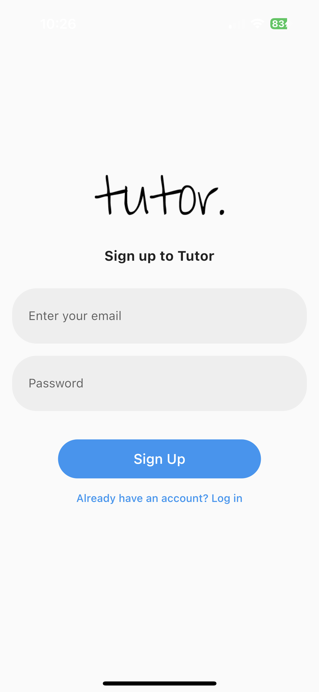
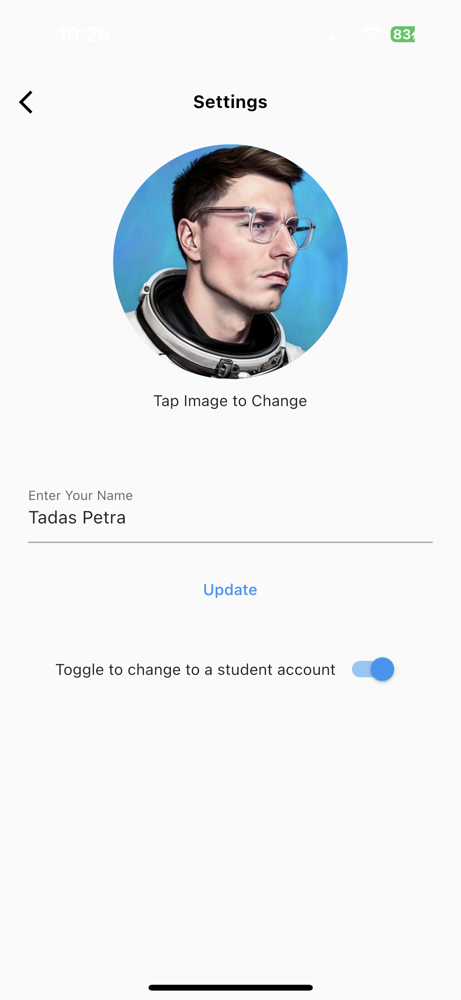
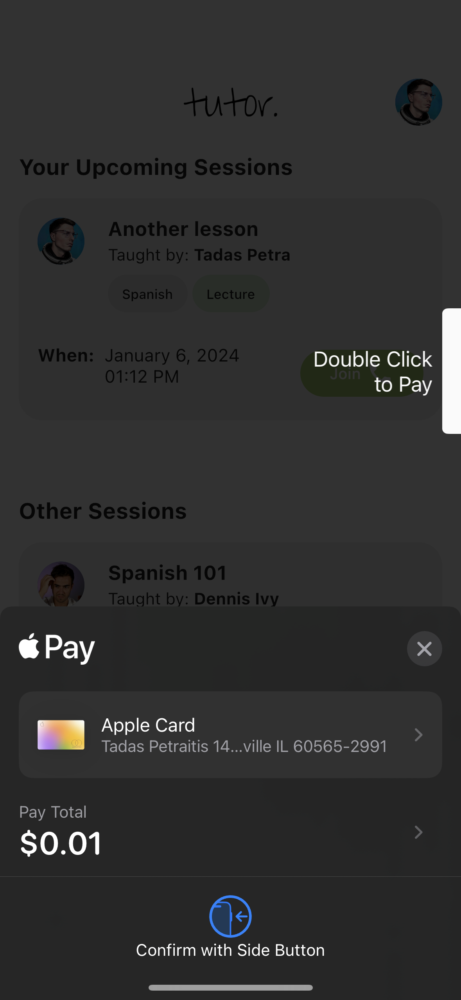

# Build Your own Tutoring Application with Agora

This guide walks you through building your own tutoring application. This application will allow you to create lessons as a teacher, and pay for and attend lessons as a student. These video lessons will be hosted on the platform. This will be a complete application including authentication, user management, payment, and tons of real-time features.

- [Getting Started](#getting-started)
- [Overview](#overview)
- [File Structure](#file-structure)
- [Architecture Diagram](#architecture-diagram)
- [User Flow Diagram](#user-flow-diagram)
- [App Screens](#app-screens)
- [Agora Overview](#agora-overview)
- [Agora Features](#agora-features)
  - [Video Call](#video-call)
  - [Cloud Recording](#cloud-recording)
    - [Start Recording](#start-recording)
    - [Stop Recording](#stop-recording)
  - [View Recorded Lessons](#view-recorded-lessons)
  - [Real-Time Transcription](#real-time-transcription)
    - [Start Transcribing](#start-transcribing)
    - [Custom Actions from Agora Events](#custom-actions-from-agora-events)
    - [Stop Transcription](#stop-transcription)
- [Other Key Features](#other-key-features)
  - [Apple Pay Integration](#apple-pay-integration)

## Getting Started
The tools we'll use for this projects are:

* Flutter
* Agora
* Firebase
* Riverpod
* Apple Pay with `pay` package
* Other Flutter packages including: `image_picker`, `video_player` and `intl`
* Custom back end built with Python and Flask

The code for the Flutter app can be found [here](https://github.com/tadaspetra/tutor). The back-end code can be found [here](https://github.com/tadaspetra/agora-server). In this blog post, we will talk about the general structure of the application. And we'll dive into the Agora Cloud Recording and Real-Time Transcription features.

## Overview
The `tutor` app will have users log in or sign up using Firebase Authentication, and it will have the state of the user managed and updated using Riverpod and Firebase Cloud Firestore. You can toggle between a teacher or a student account in the user settings. Both accounts have the ability to pay and join sessions, but the teacher account also has a special ability to create sessions. 

Once the session is started, users can see the real-time text being converted and manage their cameras. 

## File Structure
```
lib
├── models
│   ├── recording
│   ├── session
│   └── user
├── pages
│   ├── home
│   ├── recordings
│   ├── class
│   ├── create
│   ├── settings
│   ├── signin
│   └── signup
├── protobuf
├── providers
│   └── user_provider
├── consts
└── main
```

## Architecture Diagram


## User Flow Diagram


## App Screens
<div>


</div>
Login and Sign Up Screens

<div>


</div>
Teacher vs. Student Home Screen

<div>


</div>
Navigation and Settings Screens

<div>


</div>
Live Classroom Session

<div>

</div>
Apple Pay

<div>


</div>
Recordings

## Agora Overview
The main feature of the `tutor` app is the ability to have video call lessons between teacher and students. We will be using Agora for this. Agora is a real-time communication platform that allows you to build video calls, voice calls, and live streaming into your application. And it can handle all the real time communication that will be needed for this application.

## Agora Features
### Video Call
The video call is the most important part of the application because this is where the teaching will happen. For this we used the `agora_uikit` package to build the video call screen. This package is a wrapper around the Agora SDK, and it comes with a prebuilt UI, so we don't need to define it all ourselves.

You need an Agora account to use this package. You can create one at [console.agora.io](https://console.agora.io). Once you have an account, you need to create a project and get the `App ID` for the project. You need the App ID to connect to the Agora SDK.

Make sure to add the [following permissions](https://pub.dev/packages/agora_uikit#device-permission) for both iOS and Android.

To add the package run
```
flutter pub add agora_uikit
```

To secure your video calls, you will need to create a token server. Then we can link to it with our UI Kit. You can find more information about token servers [here](https://www.agora.io/en/blog/how-to-build-a-token-server-using-golang/).

Once the set-up is complete we can create a `class.dart` file and add the following code to it.
```dart
import 'package:agora_uikit/agora_uikit.dart';
import 'package:flutter/material.dart';

class ClassCall extends StatefulWidget {
  const ClassCall({Key? key}) : super(key: key);

  @override
  State<ClassCall> createState() => _ClassCallState();
}

class _ClassCallState extends State<ClassCall> {
  final AgoraClient client = AgoraClient(
    agoraConnectionData: AgoraConnectionData(
      appId: "<--Add your App Id here-->",
      channelName: "test",
      username: "user",
      tokenUrl: "<--Add your token server url here-->",
    ),
  );

  @override
  void initState() {
    super.initState();
    initAgora();
  }

  void initAgora() async {
    await client.initialize();
  }

  @override
  Widget build(BuildContext context) {
    return Scaffold(
        appBar: AppBar(
            title: const Text('Classroom'),
        ),
        body: SafeArea(
            child: Stack(
            children: [
                AgoraVideoViewer(
                    client: client,
                    layoutType: Layout.floating,
                ),
                AgoraVideoButtons(
                    client: client,
                ),
            ],
            ),
        ),
    );
  }
}
```

We want to allow users to leave this screen when they press the end call button. We don't want them to be able to swipe backward, or have a back button in the app bar. To do this, we first removed the `AppBar()` widget, and then we added the `onDisconnect` function to the `AgoraVideoButtons` widget. This function will be called when the end call button is pressed. Inside this function we just call `Navigator.pop(context)`. This will pop the current screen off the stack, and take the user back to the previous screen.

That will allow the user to not see a back button at the top, and only return back when they press the end call button. However, there are system back buttons to deal with. For both iOS and Android you can either press a system back button or swipe back. To remove this capability we will use a `WillPopScope` widget. When we wrap it around our `Scaffold`, this widget will allow us to override the default behavior of the back button. We can do this by returning a `Future<bool>` from the `onWillPop` function. If we return `true` then the back button will work as normal. If we return `false`, then the back button will not work. You can customize the `onWillPop` function to allow the page to pop under different conditions, but for our use case we will set it to always return `false`.

### Cloud Recording
With the Cloud Recording feature, you can connect your own database and record lessons in your app, which then saves a file in the database you connected. For this we need to use the Agora RESTful API with our own back-end service.

The back-end service is required for security reasons. We don't want to store our Agora customer key and customer secret in our application. This server was built with Python and Flask, and you can find the code [here](https://github.com/tadaspetra/agora-server). We will cover only the Agora API side of this server, but if you want to learn more about building a server from scratch with Flask I recommend [this video](https://www.youtube.com/watch?v=xeuW-IitQTQ).

We will implement two functions on our back-end server: `start-recording` and `stop-recording`.

#### Start Recording
Our `start-recording` endpoint needs a channel in order for our backend to know which channel this recording should be started on. Once it is started, we need to provide the caller of the endpoint, the SID, and the resource ID so that the caller knows exactly where this recording will be stored.

We cannot start the recording right away. The first step of cloud recording is to create a resource for cloud recording. And to create a resource we need a credential. To generate a credential we need a customer key and customer secret. You can create these in the Agora Console.


To get a complete credential that can be used to generate a resource, we need to encode our customer key and customer secret. We can do this with the following code.

```python
def generate_credential():
    # Generate encoded token based on customer key and secret
    credentials = CUSTOMER_KEY + ":" + CUSTOMER_SECRET

    base64_credentials = base64.b64encode(credentials.encode("utf8"))
    credential = base64_credentials.decode("utf8")
    return credential
```

Using our credential, we then need to generate that resource using [`acquire`](https://documenter.getpostman.com/view/6319646/SVSLr9AM#6e47859b-5ab5-47b0-8095-5a3ec3dba54c). This method will return a resource ID that corresponds to the resource that was created. We will use this ID to start our recording.

```python
def generate_resource(channel):

    payload = {
        "cname": channel,
        "uid": str(UID),
        "clientRequest": {}
    }

    headers = {}

    headers['Authorization'] = 'basic ' + credential

    headers['Content-Type'] = 'application/json'
    headers['Access-Control-Allow-Origin'] = '*'

    url = f"https://api.agora.io/v1/apps/{APP_ID}/cloud_recording/acquire"
    res = requests.post(url, headers=headers, data=json.dumps(payload))

    data = res.json()
    resourceId = data["resourceId"]

    return resourceId
```

Now we are ready to start the recording. You can find more details about all the configurations that you should set up [here](https://docs.agora.io/en/cloud-recording/reference/rest-api/start).

Here are some key features for our configuration

* We record in `mix` mode, so videos get combined into one file.
* We save this file into an `agora` folder on AWS.
* We save an `mp4` file.

```python
def start_cloud_recording(channel):
    resource_id = generate_resource(channel)
    url = f"https://api.agora.io/v1/apps/{APP_ID}/cloud_recording/resourceid/{resource_id}/mode/mix/start"
    payload = {
        "cname": channel,
        "uid": str(UID),
        "clientRequest": {
            "token": TEMP_TOKEN,
            "recordingConfig": {
                "maxIdleTime": 3,
            },

            "storageConfig": {
                "secretKey": SECRET_KEY,
                "vendor": 1,  # 1 is for AWS
                "region": 1,
                "bucket": BUCKET_NAME,
                "accessKey": ACCESS_KEY,
                "fileNamePrefix": [
                    "agora",
                ]
            },

            "recordingFileConfig": {
                "avFileType": [
                    "hls",
                    "mp4"
                ]
            },
        },
    }

    headers = {}

    headers['Authorization'] = 'basic ' + credential

    headers['Content-Type'] = 'application/json'
    headers['Access-Control-Allow-Origin'] = '*'

    res = requests.post(url, headers=headers, data=json.dumps(payload))
    data = res.json()
    sid = data["sid"]

    return resource_id, sid
```

With the back-end service complete, we can implement the cloud recording in our application. To do this, we need to add our link to the `cloudRecordingUrl` argument in our `AgoraClient` and set `cloudRecordingEnabled: true` on our `AgoraVideoButtons` widget.

#### Stop Recording
To stop the recording, we need to implement another function on the backend. Nothing else needs to be done on the front end side, since that is taken care of by the UI Kit. We just need a working endpoint that follows the `/stop-recording/<--Channel Name-->/<--SID-->/<--Resource ID-->` format.

The key part here is we need to return the information to the end user-specifically the mp4 link.

```python
def stop_cloud_recording(channel, resource_id, sid):
    url = f"https://api.agora.io/v1/apps/{APP_ID}/cloud_recording/resourceid/{resource_id}/sid/{sid}/mode/mix/stop"

    headers = {}

    headers['Authorization'] = 'basic ' + credential

    headers['Content-Type'] = 'application/json;charset=utf-8'
    headers['Access-Control-Allow-Origin'] = '*'

    payload = {
        "cname": channel,
        "uid": str(UID),
        "clientRequest": {
        }
    }

    res = requests.post(url, headers=headers, data=json.dumps(payload))
    data = res.json()
    resource_id = data['resourceId']
    sid = data['sid']
    server_response = data['serverResponse']
    mp4_link = server_response['fileList'][0]['fileName']
    m3u8_link = server_response['fileList'][1]['fileName']

    formatted_data = {'resource_id': resource_id, 'sid': sid,
                      'server_response': server_response, 'mp4_link': mp4_link, 'm3u8_link': m3u8_link}

    return formatted_data
```

### View Recorded Lessons
To view the recordings at any moment after the video call, we first need to store a link to where the file is located. Our app was built with Firebase Authentication and Firestore storage, so it makes sense to store the link in Firestore. 

To do this, there is a `cloudRecordingCallback` function on the `AgoraClient` that returns the mp4 link for us.

First, we create a data class to hold all the information we need when it comes to the recording.

```dart
class Recording {
  final String url;
  final String sessionId;
  final String date;

  Recording({
    required this.url,
    required this.sessionId,
    required this.date,
  });
}
```

Then since our app is built around the `UserProvider`, we will set up a function in the `StateNotifier` to store the recording.

```dart
Future<void> storeRecording(Recording recording) {
  return _firestore
      .collection("users")
      .doc(state.id)
      .collection("recordings")
      .add(
        recording.toMap(),
      );
}
```

Finally, we can call this function in our `cloudRecordingCallback`.

```dart
ref.read(userProvider.notifier).storeRecording(
      Recording(
        url: mp4,
        sessionId: widget.sessionId,
        date:
            "${DateFormat.yMMMMd('en_US').format(DateTime.now())}\n${DateFormat("hh:mm a").format(DateTime.now())}",
      ),
    );
```

We display these recordings by showing a list of all the recordings for the user. They can click each recording to view its playback. To do that, we will add another function to our user provider to retrieve all the data that's needed.

```dart
Future<List<Recording>> getRecordings() async {
  QuerySnapshot response = await _firestore
      .collection("users")
      .doc(state.id)
      .collection("recordings")
      .get();
  List<Recording> recordings = [];
  for (DocumentSnapshot snapshot in response.docs) {
    recordings
        .add(Recording.fromMap(snapshot.data() as Map<String, dynamic>));
  }
  return recordings;
}
```

Then we display a list view of the recordings that can be accessed through the `Drawer` widget. 

```dart
class RecordingList extends ConsumerWidget {
  const RecordingList({super.key});

  @override
  Widget build(BuildContext context, WidgetRef ref) {
    return Scaffold(
      appBar: AppBar(
        title: const Text('Recordings'),
      ),
      body: FutureBuilder(
          future: ref.watch(userProvider.notifier).getRecordings(),
          builder: (context, snapshot) {
            if (snapshot.hasData) {
              return ListView.builder(
                itemCount: snapshot.data!.length,
                itemBuilder: (context, index) {
                  return ListTile(
                    title: Text(snapshot.data![index].url),
                    subtitle: Text(snapshot.data![index].date),
                    onTap: () {
                      Navigator.push(
                        context,
                        MaterialPageRoute(
                          builder: (context) => Recording(
                            url: snapshot.data![index].url,
                          ),
                        ),
                      );
                    },
                  );
                },
              );
            } else {
              return const Center(child: CircularProgressIndicator());
            }
          }),
    );
  }
}
```

Finally, using the `video_player` package, we display the video on a new screen.

```dart
class Recording extends StatefulWidget {
  final String url;
  const Recording({super.key, required this.url});

  @override
  State<Recording> createState() => _RecordingState();
}

class _RecordingState extends State<Recording> {
  late VideoPlayerController _controller;
  late Future<void> _initializeVideoPlayerFuture;

  @override
  void initState() {
    super.initState();
    _controller = VideoPlayerController.network(
      "https://agora-server.s3.us-east-2.amazonaws.com/${widget.url}",
    );

    _initializeVideoPlayerFuture = _controller.initialize();

    _controller.setLooping(true);
  }

  @override
  void dispose() {
    _controller.dispose();

    super.dispose();
  }

  @override
  Widget build(BuildContext context) {
    return Scaffold(
      appBar: AppBar(),
      body: FutureBuilder(
        future: _initializeVideoPlayerFuture,
        builder: (context, snapshot) {
          if (snapshot.connectionState == ConnectionState.done) {
            return AspectRatio(
              aspectRatio: _controller.value.aspectRatio,
              child: VideoPlayer(_controller),
            );
          } else {
            return const Center(
              child: CircularProgressIndicator(),
            );
          }
        },
      ),
      floatingActionButton: FloatingActionButton(
        onPressed: () {
          setState(() {
            if (_controller.value.isPlaying) {
              _controller.pause();
            } else {
              _controller.play();
            }
          });
        },
        child: Icon(
          _controller.value.isPlaying ? Icons.pause : Icons.play_arrow,
        ),
      ),
    );
  }
}
```

### Real-Time Transcription
The Real-Time Transcription feature uses a process similar to the Cloud Recording feature. We will again need to use the Agora RESTful API with our own back-end service.

The back-end service is required for security reasons. We don't want to store our Agora customer key and customer secret in our application. This server was built with Python and Flask, and you can find the code [here](https://github.com/tadaspetra/agora-server). We will cover only the Agora API side of this server, but if you want to learn more about building a server from scratch with Flask, I recommend [this video](https://www.youtube.com/watch?v=xeuW-IitQTQ).

We will implement two functions on our back-end server: `start-transcribing` and `stop-transcribing`.

#### Start Transcribing
Our `start-transcribing` endpoint needs a channel so that our backend knows which channel this transcription should be started on. Once it is started, we need to provide the caller of the endpoint, the task ID and the builder token so that the caller knows exactly where this transcription will be stored.

We cannot start transcribing right away. The first step of real-time transcription is to create a resource for transcribing. To create a resource we need a credential. To generate a credential we need a customer key and customer secret. You can create these in the Agora Console.


```python
def rtt_generate_resource(channel):

    payload = {
        "instanceId": channel,
    }

    headers = {}

    headers['Authorization'] = 'basic ' + credential

    headers['Content-Type'] = 'application/json'
    headers['Access-Control-Allow-Origin'] = '*'

    url = f"https://api.agora.io/v1/projects/{APP_ID}/rtsc/speech-to-text/builderTokens"
    res = requests.post(url, headers=headers, data=json.dumps(payload))

    data = res.json()
    tokenName = data["tokenName"]

    return tokenName
```

Using our credential, we then need to generate that resource using [`acquire`](https://documenter.getpostman.com/view/6319646/SVSLr9AM#89043c3d-ae8a-4180-a5f4-ede8de441fd4). This method will return a tokenName that corresponds to the resource that was created. We will use the tokenName to start transcribing.

```python
def rtt_generate_resource(channel):

    payload = {
        "instanceId": channel,
    }

    headers = {}

    headers['Authorization'] = 'basic ' + credential

    headers['Content-Type'] = 'application/json'
    headers['Access-Control-Allow-Origin'] = '*'

    url = f"https://api.agora.io/v1/projects/{APP_ID}/rtsc/speech-to-text/builderTokens"
    res = requests.post(url, headers=headers, data=json.dumps(payload))

    data = res.json()
    tokenName = data["tokenName"]

    return tokenName
```

Now we are ready to start transcribing. You can find more details about all the configurations that you should set up [here](https://documenter.getpostman.com/view/6319646/SVSLr9AM#92041cab-1f45-4ff3-83a5-601fa06a0427).

Here are some key features for our configuration:

* We can transcribe in English and Spanish
* We store the transcription in a folder named rtt

```python
def start_transcription(channel):
    tokenName = rtt_generate_resource(channel)
    url = f"https://api.agora.io/v1/projects/{APP_ID}/rtsc/speech-to-text/tasks?builderToken={tokenName}"
    payload = {
        "audio": {
            "subscribeSource": "AGORARTC",
            "agoraRtcConfig": {
                "channelName": channel,
                "uid": "101",
                "token": "{{channelToken}}",
                "channelType": "LIVE_TYPE",
                "subscribeConfig": {
                    "subscribeMode": "CHANNEL_MODE"
                },
                "maxIdleTime": 60
            }
        },
        "config": {
            "features": [
                "RECOGNIZE"
            ],
            "recognizeConfig": {
                "language": "en-US,es-ES",
                "model": "Model",
                "output": {
                    "destinations": [
                        "AgoraRTCDataStream",
                        "Storage"
                    ],
                    "agoraRTCDataStream": {
                        "channelName": channel,
                        "uid": "101",
                        "token": "{{channelToken}}"
                    },
                    "cloudStorage": [
                        {
                            "format": "HLS",
                            "storageConfig": {
                                "accessKey": ACCESS_KEY,
                                "secretKey": SECRET_KEY,
                                "bucket": BUCKET_NAME,
                                "vendor": 1,
                                "region": 1,
                                "fileNamePrefix": [
                                    "rtt"
                                ]
                            }
                        }
                    ]
                }
            }
        }
    }

    headers = {}

    headers['Authorization'] = 'basic ' + credential

    headers['Content-Type'] = 'application/json'

    res = requests.post(url, headers=headers, data=json.dumps(payload))
    data = res.json()
    taskID = data["taskId"]

    return taskID, tokenName
```

To start this process, we add this call to the `initState` of our `StatefulWidget`.

```dart
 final response = await http.post(
  Uri.parse(
      'https://agora-server-hr4b.onrender.com/start-transcribing/main'),
);
taskId = jsonDecode(response.body)['taskId'];
builderToken = jsonDecode(response.body)['builderToken'];
```
#### Custom Actions from Agora Events
But calling this endpoint doesn't actually show anything in our application. To do that, we need to set up a [protobuf for our project](https://protobuf.dev/getting-started/darttutorial/). 

Here is a template for Agora Real-Time Transcription
```
syntax = "proto3";

package agora.audio2text;
option java_package = "io.agora.rtc.audio2text";
option java_outer_classname = "Audio2TextProtobuffer";

message Text {
  int32 vendor = 1;
  int32 version = 2;
  int32 seqnum = 3;
  int32 uid = 4;
  int32 flag = 5;
  int64 time = 6;
  int32 lang = 7;
  int32 starttime = 8;
  int32 offtime = 9;
  repeated Word words = 10;
}
message Word {
  string text = 1;
  int32 start_ms = 2;
  int32 duration_ms = 3;
  bool is_final = 4;
  double confidence = 5;
}
```

Once the protocol buffer is set up, we retrieve the transcribed message from the `onStreamMessage` callback. We can take this message, run it through our protobuf, and add the text to a list.

```dart
agoraEventHandlers: AgoraRtcEventHandlers(
  onStreamMessage:
      (connection, remoteUid, streamId, data, length, sentTs) {
    protoText.Text sttText = protoText.Text.fromBuffer(data);
    if (sttText.words.isNotEmpty) {
      sttText.words.last.isFinal
          ? updateConversation(sttText.words.last.text)
          : null;
    }
  },
  onStreamMessageError:
      (connection, remoteUid, streamId, code, missed, cached) {
    print("error $code");
  },
)
```

When we add this view on top of our stack we can see the transcription happening live.

```dart
Padding(
  padding: const EdgeInsets.only(bottom: 100.0, top: 200),
  child: ListView.builder(
    controller: _controller,
    itemBuilder: (context, index) {
      return ListTile(
        title: Text(
          conversation[index],
          style: const TextStyle(
            color: Colors.white,
          ),
        ),
      );
    },
    itemCount: conversation.length,
  ),
),
```

#### Stop Transcription
The last step is to stop the transcription after the call is complete. We need a working endpoint that follows the `/stop-transcribing/<--Channel Name-->/<--Task ID-->/<--Builder Token-->` format.

```python
def stop_transcription(task_id, builder_token):
    url = f"https://api.agora.io/v1/projects/{APP_ID}/rtsc/speech-to-text/tasks/{task_id}?builderToken={builder_token}"

    headers = {}

    headers['Authorization'] = 'basic ' + credential

    headers['Content-Type'] = 'application/json'

    payload = {}

    res = requests.delete(url, headers=headers, data=payload)
    data = res.json()
    return data
```

Then we call that endpoint from our Flutter application whenever the endCall button is pressed, and our real-time transcription will be  complete.
```dart
http.get(Uri.parse(
  'https://agora-server-hr4b.onrender.com/stop-transcribing/$taskId/$builderToken'));
```

## Other Key Features

### Apple Pay Integration

To have Apple Pay on your app, you need to be a valid merchant and have your merchant ID connected to your application. You can find more information about that on this [Apple Pay Guide](https://www.hungrimind.com/flutter/apple_pay).

Once you have that set up, on the `onPaymentResult` argument in the Apple Pay button, we will execute a `joinSession` function defined in our user provider. This function will add the session to the current student's upcoming sessions list and add that student's ID to the class's student list.

```dart
Future<void> joinSession(String sessionId, bool isLecture) async {
  await _firestore.collection("users").doc(state.id).update({
    'upcomingSessions': FieldValue.arrayUnion([sessionId])
  });

  if (!isLecture) {
    await _firestore.collection("sessions").doc(sessionId).update({
      'students': FieldValue.arrayUnion([state.id])
    });
  }
  state = state.copyWith(
      user: state.user.copyWith(
          upcomingSessions: [...state.user.upcomingSessions, sessionId]));
}
```