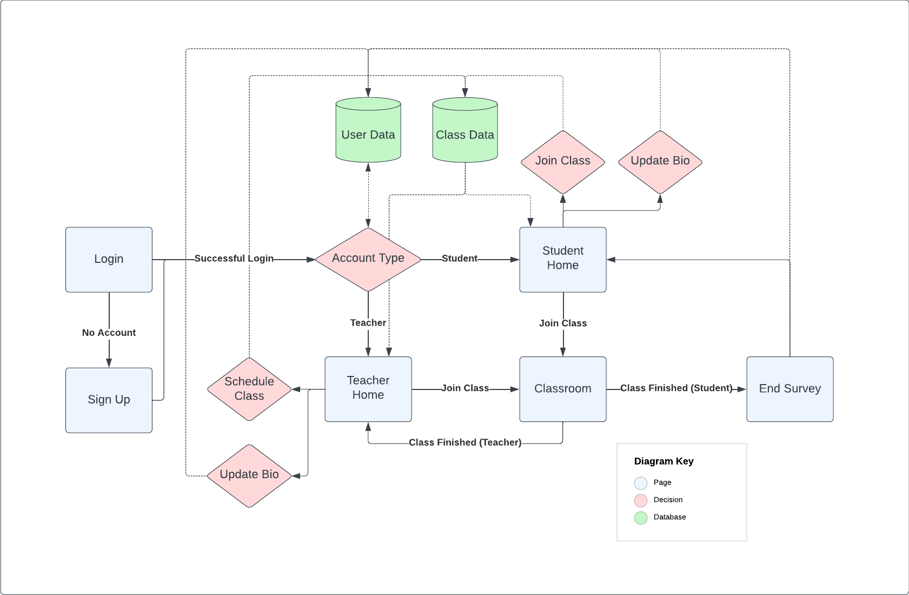

# Tutoring Reference Application Specification

Reference app for a math tutoring use case.

# Summary

Tutoring is a very popular sector for Flutter applications. Tutoring is a real time interaction that is either 1-1 or 1-many, and in this case Agora is well suited to provide a reliable solution to any tutoring application. This reference app will be targeted at a Mathematics specific use case.

# Business Strategy

This reference app aims to provide a strong starting point for anybody looking to build a tutoring application. It will utilize the latest technologies so developers can take the code, have the foundation ready to go and are free to develop the fun part: which is building new features.

# Target Users

**Math Teachers -** Will use this application to host live interactive 1-1 classes, or larger lectures. They will also be able to make an income from this application as each student has to pay to attend.
**Student -** With an option for personal tutoring sessions or bigger live sessions, students can use this app to get help and dive deeper into the topics they are trying to learn.

# Tech Spec

- Built with Flutter 3.7
- Target Devices: Android, iOS, Web
- Minimum Versions
  - Android SDK 32
  - iOS 16.0

# Structure Diagram

# Functional Requirements

| Req # | Use Case           | Feature Requirements                                                                                                                                                                       |
| ----- | ------------------ | ------------------------------------------------------------------------------------------------------------------------------------------------------------------------------------------ |
| 1     | 1-1 Video Call     | <ul><li>Join a Session</li><li>Leave a Session</li><li>Hear and see each other</li><li>Mute Microphone</li><li>Turn Video On/Off</li></ul>                                                 |
| 2     | Lecture Group Call | <ul><li>Join a Session</li><li>Leave a Session</li><li>Hear and see each other</li><li>Mute Microphone</li><li>Turn Video On/Off</li></ul>                                                 |
| 3     | Lesson Recordings  | <ul><li>Record lesson</li><li>View recorded lesson</li></ul>                                                                                                                               |
| 4     | Speech to Text     | <ul><li>View lesson text</li></ul>                                                                                                                                                         |
| 5     | Screen Share       | <ul><li>Toggle Screen Share</li><li>Choose which screen/window to share</li></ul>                                                                                                          |
| 6     | Schedule a Session | <ul><li>Display available sessions with tutor and session info</li><li>Select Available session with chosen tutor</li><li>Pay for the session</li><li>As a tutor, create session</li></ul> |

# Feature Specification

| Use Case           | Feature                      | Details                                                                                  | Priority | Agora Tools        | External Tools       | Timeline |
| ------------------ | ---------------------------- | ---------------------------------------------------------------------------------------- | -------- | ------------------ | -------------------- | -------- |
| 1-1 Video Call     | Join a Session               | Request permissions, create RTC Engine, join channel, publish and subscribe              | P0       | RTC & Token Server |                      | 0.25     |
|                    | Leave a Session              | Leave the channel                                                                        | P0       | RTC                |                      | 0.25     |
|                    | Hear and see each other      | Enable video before joining channel                                                      | P0       | RTC                |                      | 0.25     |
|                    | Mute Microphone              | Toggle microphone on engine, and show in UI                                              | P0       | RTC                |                      | 0.25     |
|                    | Turn Video On/Off            | Toggle video on engine and show in UI                                                    | P0       | RTC                |                      | 0.25     |
| Lecture Group Call | Join a Session               | Request permissions, create RTC Engine, join channel, publish and subscribe              | P0       | RTC & Token Server |                      | 0.25     |
|                    | Leave a Session              | Leave the channel                                                                        | P0       | RTC                |                      | 0.25     |
|                    | Hear and see each other      | Enable video before joining channel                                                      | P0       | RTC                |                      | 0.25     |
|                    | Mute Microphone              | Toggle microphone on engine, and show in UI                                              | P0       | RTC                |                      | 0.25     |
|                    | Turn Video On/Off            | Toggle video on engine and show in UI                                                    | P0       | RTC                |                      | 0.25     |
| Lesson Recording   | Record Lesson                | Save a recording of the lesson to a database                                             | P0       | Cloud Recording    | AWS                  | 3        |
|                    | View Recorded Lesson         | Retrieve lesson, and show only to users who have paid for that session                   | P0       | Cloud Recording    | AWS                  | 2        |
| Speech to Text     | Display Text                 | Display speech to text                                                                   | P0       | STT                | AWS                  | 4        |
| Screen Share       | Toggle Screen Share          | Toggle screen share on engine, and update UI                                             | -        | RTC                |                      | 3        |
|                    | Choose which screen to share | When screen share gets toggled, show a UI of which screen user wants to share            | -        | RTC                |                      | 0.5      |
| Schedule a Session | Display Tutors               | Show a list of tutors stored in the database with what they specialize and their ratings | P0       |                    | Firebase             | 1        |
|                    | Select Session               | Can click into the session, register, and have it show as upcoming on your home screen   | P0       |                    | Firebase             | 1        |
|                    | Pay for session              | Before students can join the session they have to pay using Stripe                       | P1       |                    | GooglePay + ApplePay | 3-5      |
|                    | Create Session               | Tutors can create sessions that students can pay for and join                            | P0       |                    | Firebase             | 1        |
